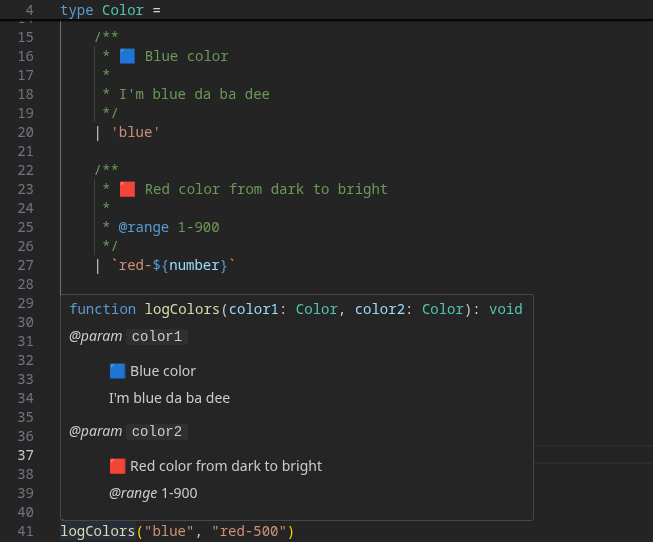

# 🟦 TypeScript Union Docs VSCode Extension

A **VSCode TypeScript extension** that displays **JSDoc comments** from union type members directly in your editor's **quick info** (hover) tooltips.

	

> [!IMPORTANT]
> Issues please to the [TS language plugin repository](https://github.com/Serveny/ts-union-docs-plugin)

### 💡 The Problem

By default, when you use a value from a union type, TypeScript's quick info just shows the literal value or the base union type. Documentation associated with that specific member of the union is ignored.

### ✨ The Solution

It wraps the TS compiler plugin _ts-union-docs-plugin_ and acivates it for the VSCode internal TypeScript compiler. The real magic happens here: https://github.com/Serveny/ts-union-docs-plugin

## Extension Settings

None
